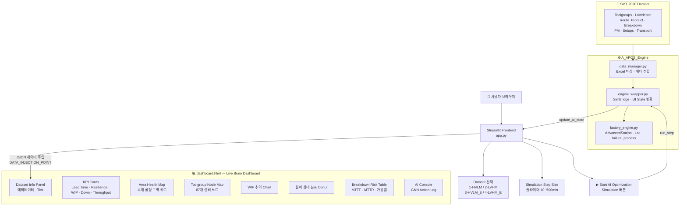

# 🏭 A-APOS: AI-Powered Autonomous Production Optimization System
### SMT 2020 Factory Digital Twin · Live Brain Dashboard

> 반도체 공장의 실시간 디지털 트윈 + GNN 기반 AI 스케줄링 최적화 SaaS 플랫폼

---

## 📌 프로젝트 개요

A-APOS는 **SMT 2020 반도체 제조 데이터셋**을 기반으로, SimPy 이산사건 시뮬레이션 엔진 위에 GNN(Graph Neural Network) AI 에이전트를 올려 실시간으로 공장 스케줄링을 최적화하는 SaaS 대시보드입니다.

공장의 87개 Toolgroup 설비를 디지털 트윈으로 구현하고, AI가 내리는 매 결정(우선순위 조정, 배치 최적화, 병목 예측)을 사용자가 실시간으로 시각적으로 확인할 수 있습니다.

---

## 🗂️ 데이터셋 구조 (SMT 2020)

본 프로젝트는 4개의 산업용 반도체 제조 시뮬레이션 데이터셋을 사용합니다.

| Dataset | 코드명 | 특징 |
|---------|--------|------|
| 1 | HVLM | High Volume Low Mix — 소품종 대량생산, 설비 고장 없음 |
| 2 | LVHM | Low Volume High Mix — 다품종 소량생산, 설비 고장 없음 |
| 3 | HVLM_E | HVLM + Breakdown/PM 변동성 포함 |
| 4 | LVHM_E | LVHM + Breakdown/PM 변동성 포함 **(기본값)** |

### 데이터셋 구성 파일 (Dataset 4 기준)

| 파일/시트 | 내용 |
|-----------|------|
| `Toolgroups` | 11개 공정 구역, 87개 Toolgroup, 설비 대수, 디스패칭 룰 |
| `Lotrelease` | 13개 제품(Product 1~10 + Engineering E1~E3), 우선순위, 투입 간격 |
| `Route_Product_*` | 제품별 공정 순서, 처리시간 분포, 배치 크기(BATCH MIN/MAX) |
| `Breakdown` | 11개 구역별 MTTF/MTTR (고장 주기 / 수리 시간) |
| `PM` | 예방 정비(Planned Maintenance) 일정 및 소요 시간 |
| `Setups` | 설비 셋업 변경 시간 매트릭스 |
| `Transport` | 구역 간 이동 시간 분포 |

### 공정 구역 (11개 Area)

`Diffusion` · `Dry_Etch` · `Litho` · `Implant` · `Dielectric` · `Planar` · `TF` · `Wet_Etch` · `Def_Met` · `Litho_Met` · `TF_Met`

### 제품 구성 (13개 Product)

| 구분 | 제품 | 우선순위 | 웨이퍼/Lot | 공정 스텝 수 |
|------|------|----------|-----------|-------------|
| HotLot | Product_1 ~ 5 | 20 (긴급) | 25장 | 344 ~ 584 |
| Regular | Product_6 ~ 10 | 10 (일반) | 25장 | 530 |
| Engineering | Product_E1 ~ E3 | 10 (일반) | 1 ~ 2장 | 522 ~ 584 |

---

## 🏗️ 시스템 아키텍처



---

## 📁 프로젝트 파일 구조

```
A-APOS_SaaS/
│
├── app.py                          # Streamlit 메인 앱
├── requirements.txt                # 패키지 의존성
├── README.md
│
├── A_APOS_Engine/                  # 시뮬레이션 엔진 패키지
│   ├── __init__.py
│   ├── data_manager.py             # 데이터 로딩 및 파싱
│   ├── engine_wrapper.py           # SimPy ↔ UI 브리지
│   ├── factory_engine.py           # 핵심 시뮬레이션 로직
│   └── dashboard.html              # Live Brain Dashboard UI
│
└── SMT_2020 - Final/
    └── AutoSched/
        ├── dataset 1/HVLM_Model/
        ├── dataset 2/LVHM_Model/
        ├── dataset 3/HVLM_E_Model/
        └── dataset 4/LVHM_E_Model/
            ├── order.txt
            ├── route_*.txt
            ├── setup.txt
            └── downcal.txt
```

---

## ⚙️ 엔진 상세 설명

### `data_manager.py` — APOSDataManager

Excel/txt 원시 데이터를 시뮬레이션이 사용할 수 있는 구조체로 변환합니다.

```python
dm = APOSDataManager(base_path="SMT_2020 - Final/AutoSched")
data = dm.load_dataset(4)
# 반환값:
# {
#   "orders": DataFrame,        # 생산 주문 목록
#   "routes": {"part_1": DataFrame, ...},  # 제품별 공정 순서
#   "setup": DataFrame,         # 셋업 변경 시간 매트릭스
#   "downs": DataFrame,         # 설비 고장 데이터 (Dataset 3, 4만)
#   "metadata": {
#     "total_parts": 13,
#     "avg_steps": 530,
#     "bn_candidates": ["Diffusion_FE_125", ...]
#   }
# }
```

**병목 후보(BN Candidates) 추출 기준:**
- `BATCHMN >= 100` (최소 배치 크기 100 이상) 또는
- `STIME >= 60` (셋업 시간 60분 이상)

---

### `factory_engine.py` — 핵심 시뮬레이션

**`AdvancedStation`** — SimPy PreemptiveResource 기반 설비 모델

```
Lot 도착
  → 셋업 변경 필요 시 setup_cost 만큼 대기
  → Batch 설비이면 min_batch 충족될 때까지 대기
  → Resource 획득 후 처리시간(ptime) 동안 점유
  → 완료 → 다음 공정으로 이동
```

**`failure_process`** — 설비 고장 시뮬레이션 (Dataset 3, 4 전용)

```python
while True:
    yield env.timeout(exponential(MTTF))   # 고장까지 대기
    yield resource.request(priority=-1)    # 최고 우선순위로 자원 강제 점유
    yield env.timeout(exponential(MTTR))   # 수리 완료까지 대기
```

---

### `engine_wrapper.py` — SimBridge

SimPy 엔진과 Streamlit UI 사이의 브리지 역할을 합니다.

```python
bridge = SimBridge(env, data)

# UI 상태 추출 (매 rerun마다 호출)
state = bridge.update_ui_state()
# {
#   "tick": 450,
#   "wip": 1248,
#   "stations": [
#     {"id": "Diffusion_FE_120", "state": "busy"},
#     {"id": "Litho_FE_98",      "state": "down"},
#     ...
#   ]
# }

# 시뮬레이션 진행
bridge.run_step(until=500)  # SimPy를 T=500까지 실행
```

---

### `dashboard.html` — Live Brain Dashboard

Streamlit의 `components.html()`로 삽입되는 순수 HTML/CSS/JS 대시보드입니다.
`app.py`가 `// [DATA_INJECTION_POINT]` 자리에 실시간 JSON을 주입합니다.

```python
# app.py 핵심 데이터 주입 로직
data_injection = f"const realData = {json.dumps(current_state)};"
final_html = html_template.replace("// [DATA_INJECTION_POINT]", data_injection)
components.html(final_html, height=1500, scrolling=False)
```

**향후 GNN 모델 실시간 연동용 postMessage 브리지 (내장):**

```javascript
window.addEventListener('message', (e) => {
  if (e.data.type === 'apos_update') {
    updateNodes(e.data.payload.stations);  // 노드 상태 갱신
    updateCharts(e.data.payload.wip);      // 차트 갱신
    addLog(e.data.payload.action_log);     // AI 로그 추가
  }
});
```

---

## 📊 대시보드 UI 상세 설명

### 1️⃣ Dataset Info Panel
현재 로드된 데이터셋의 정적 메타데이터를 한눈에 표시합니다.

| 항목 | 내용 |
|------|------|
| 제품 수 | 현재 데이터셋의 제품 종류 수 |
| 평균 공정 스텝 | 제품 1개가 거치는 평균 공정 단계 수 |
| Toolgroup 수 | 총 설비 그룹 수 |
| Breakdown 구역 | 고장 리스크 모니터링 중인 구역 수 |
| Baseline Lead Time | AI 최적화 전 기준 리드타임 (시간) |
| Sim Time (Tick) | 현재 시뮬레이션 진행 시각 (분 단위) |

---

### 2️⃣ KPI Cards (5개 핵심 지표)

| KPI | 설명 |
|-----|------|
| **Lead Time (AI Opt.)** | AI 최적화 후 예상 리드타임. Baseline 대비 감소율(%) 표시 |
| **Resilience Score** | 설비 고장/변동성 발생 시 납기 방어 능력 점수 (0~100) |
| **WIP (Live)** | 현재 공정 중인 Lot 총 수량. 실시간으로 변동 |
| **Down Alerts** | 현재 다운(고장) 상태인 설비 수. 빨간색 강조 표시 |
| **Throughput (est.)** | 단위 Tick당 완료 예상 Lot 수 |

---

### 3️⃣ Area Health Map (공정 구역 현황)

11개 공정 구역(Area)을 카드 형태로 표시합니다.

- **파란 게이지 바** — 해당 구역 전체 설비 가동률 (높을수록 파란색 → 주황 → 빨강)
- **빨간 삼각형 표시** — Down 설비가 1개 이상 있는 구역에 경고 표시
- **카드 클릭** — 해당 구역의 설비만 Node Map에서 하이라이트, 나머지는 흐리게 처리

---

### 4️⃣ Toolgroup Node Map

87개 Toolgroup을 12×12px 정사각형 노드로 표현합니다.

| 색상 | 상태 | 의미 |
|------|------|------|
| 🟦 청록 | `Busy` | 현재 Lot을 처리 중 |
| 🟧 주황 | `Setup` | 셋업 변경(제품 전환) 진행 중 |
| 🔴 빨강 (깜빡임) | `Down` | 고장 또는 수리 중 |
| ⬛ 어두운 회색 | `Idle` | 유휴 상태 (대기 Lot 없음) |
| 🟣 보라 외곽선 | `BN Candidate` | 병목 후보 설비 |

> 노드 클릭 시 팝업이 열리며, 해당 설비의 가동률 / 리드타임 추이 / MTTF·MTTR 고장 리스크를 상세 확인할 수 있습니다.

---

### 5️⃣ WIP 추이 차트

최근 30 Step의 WIP(재공품, Work-In-Process) 수량 변화를 실시간 Line Chart로 표시합니다.

- WIP가 **급증** → 특정 구역에 병목 발생, Lot이 쌓이고 있음
- WIP가 **급감** → 투입이 줄거나 처리 속도가 빨라짐

---

### 6️⃣ Breakdown Risk Table

11개 공정 구역의 설비 고장 리스크를 테이블로 표시합니다.

| 컬럼 | 설명 |
|------|------|
| **MTTF** | Mean Time To Failure — 평균 고장 간격 (분). 클수록 안정적 |
| **MTTR** | Mean Time To Repair — 평균 수리 시간 (분). 작을수록 좋음 |
| **Availability** | `MTTF ÷ (MTTF + MTTR) × 100` — 설비 가용률 |
| **RISK** | MTTR 기준: HIGH(>400분) / MED(>150분) / LOW |

**Dataset 4 고위험 구역:**

| 구역 | MTTR | 가용률 | 리스크 |
|------|------|--------|--------|
| Litho | 705분 | 93.5% | 🔴 HIGH |
| Implant | 604분 | 94.3% | 🔴 HIGH |
| Dielectric | 604분 | 94.3% | 🔴 HIGH |
| TF | 453분 | 95.7% | 🔴 HIGH |
| Dry_Etch | 231분 | 97.8% | 🟡 MED |

---

### 7️⃣ AI Decision Engine Console

GNN 에이전트가 내리는 실시간 결정 로그를 터미널 스타일로 표시합니다.

```
[10:23:41] > GNN Action: Priority uplift → Lot #2341 (due approaching)
[10:23:42] > State Alert: High WIP at Litho · queue depth 34
[10:23:44] > AI Insight: Predicted bottleneck at Diffusion in 52min
[10:23:45] > Resilience: Re-routing lots around Station #18 (Down)
[10:23:47] > GNN Decision: Batch size → 100 for next wave
```

---

## 🚀 설치 및 실행

### 요구사항

```
Python >= 3.10
simpy >= 4.1.1
pandas >= 2.0.0
numpy >= 1.24.0
streamlit >= 1.30.0
openpyxl >= 3.1.0
```

### 설치

```bash
git clone https://github.com/bbongappang/A-APOS-SaaS.git
cd A-APOS-SaaS
pip install -r requirements.txt
```

### 실행

```bash
streamlit run app.py
# → http://localhost:8501
```

---

## 🗺️ 개발 로드맵

### ✅ 완료 (Phase 1~2)

- [x] SMT 2020 데이터셋 파싱 및 정제 (`data_manager.py`)
- [x] SimPy 기반 디지털 트윈 환경 구축 (`factory_engine.py`)
- [x] Streamlit + HTML 하이브리드 대시보드 (`dashboard.html`)
- [x] 실시간 KPI, Area Map, Node Map, Breakdown Risk 시각화
- [x] Dataset 1~4 동적 전환 기능

### 🔄 진행 중 (Phase 3 — AI Brain)

- [ ] GNN 기반 동적 우선순위 할당 에이전트
  - 설비 상태 그래프 임베딩 (adjacency matrix → GNN input)
  - 출력: `[(lot_id, new_priority), (station_id, batch_size)]`
- [ ] Random Forest / XGBoost 병목 예측 모델
  - 입력: 현재 WIP, 설비 가동률, MTTF 잔여 시간
  - 출력: n분 내 고장 확률
- [ ] 휴리스틱 동적 배치 최적화
  - WIP 임계치 기반 BATCH_MIN/MAX 자동 조정

### 📋 예정 (Phase 4 확장)

- [ ] What-if Controller (설비 강제 다운 / 배치 사이즈 조작 슬라이더)
- [ ] Resilience Score 정식 계산 로직 (납기 준수율 기반)
- [ ] GNN 학습 결과 비교 뷰 (Before AI / After AI 나란히 표시)
- [ ] 시뮬레이션 결과 CSV 내보내기

---

## 🧠 AI 모델 연동 방법 (개발자용)

GNN 에이전트를 붙일 때 `app.py`의 시뮬레이션 루프를 다음과 같이 확장합니다.

```python
if run_sim:
    while True:
        # 1. 현재 상태 추출
        state = st.session_state.bridge.update_ui_state()

        # 2. GNN 에이전트 결정 (추가 예정)
        # actions = gnn_agent.act(state)
        # st.session_state.bridge.apply_actions(actions)

        # 3. 시뮬레이션 진행
        st.session_state.tick += sim_speed
        st.session_state.bridge.run_step(until=st.session_state.tick)

        # 4. UI 갱신
        time.sleep(0.05)
        st.rerun()
```

---

## 👥 팀 구성

| 역할 | 담당 |
|------|------|
| 프로젝트 기획 / PM | |
| SimPy 엔진 설계 | |
| GNN AI 모델 | |
| Streamlit UI / Dashboard | |
| 데이터 전처리 | |

---

## 📄 라이선스

본 프로젝트는 학술 및 연구 목적으로 제작되었습니다.
SMT 2020 데이터셋은 공개 연구용 데이터셋입니다.

---

*A-APOS · Built with SimPy + Streamlit + Chart.js*  
*"공장의 두뇌를 소프트웨어로 — Live Brain Dashboard"*
